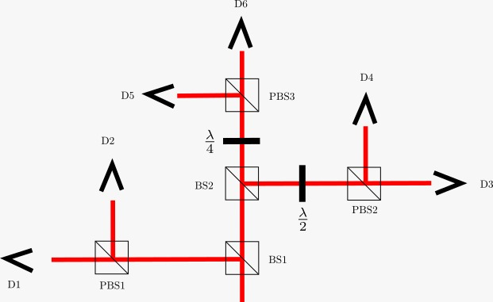

# Basic Usage

Possibly the simplest setup for quantum state tomography is the tomography of the polarization state of a single photon, as illustrated bellow.



The following code snippet demonstrates how this can be modeled in the package:

```@example
import Random #hide
Random.seed!(1234) #hide
using BayesianTomography

bs_povm = [[1.0+im 0; 0 0], [0 0; 0 1]] #POVM for a polarazing beam splitter
half_wave_plate = [1 1; 1 -1] / √2 #Unitary matrix for a half-wave plate
quarter_wave_plate = [1 im; im 1] / √2 #Unitary matrix for a quarter-wave plate

"""Augment the bs_povm with the action of half-wave plate and the quarter-wave plate. 
This is done because a single PBS is not enough to measure the polarization state of a photon."""
povm = augment_povm(bs_povm, half_wave_plate, quarter_wave_plate, 
                        weights=[1 / 2, 1 / 4, 1 / 4])

#Generate a random quantum state to be used as an example.
ρ = sample(ProductMeasure(2))

#Linear inversion method
mthd = LinearInversion(povm)

#Simulate outcomes
#Note that we need a large number of outcomes for this method to work well.
outcomes = simulate_outcomes(ρ, povm, 10^6) 
σ = prediction(outcomes, mthd) #Make a prediction
fidelity(ρ, σ) #Calculate the fidelity
```

Let us break down the code snippet. First, one need to specify the measurement that is being performed. We do that by specifying a Postive Operator Value Measure (POVM), which is a collection of positive semi-definite matrices that sum to the identity. Each matrix $F$ corresponds to a measurement outcome in such a way that the probability of obtaining a given outcome is given by the Born rule $\text{Tr} \rho F$, where $\rho$ is the quantum state. In this package, any kind of collection of matrices can be used as a POVM, as long as they satisfy the POVM condition.

An example of a POVM is the one performed by a polarizing beam splitter (PBS):
```julia
bs_povm = [[1.0+im 0; 0 0], [0 0; 0 1]] #POVM for a polarazing beam splitter
```
This POVM has two outcomes, corresponding to the vertical and horizontal polarizations. Nonetheless, this POVM is not enough to completely determine an arbitrary state (it is called informationally incomplete). To do that, we need to add the action of a half-wave plate and a quarter-wave plate to the POVM. This is done by the [`augment_povm`](@ref) function:
```julia
half_wave_plate = [1 1; 1 -1] / √2 #Unitary matrix for a half-wave plate
quarter_wave_plate = [1 im; im 1] / √2 #Unitary matrix for a quarter-wave plate

"""Augment the bs_povm with the action of half-wave plate and the quarter-wave plate. 
This is done because a single PBS is not enough to measure the polarization state of a photon."""
povm = augment_povm(bs_povm, half_wave_plate, quater_wave_plate, 
                        weights=[1 / 2, 1 / 4, 1 / 4])
```
The half-wave and quarter-wave plates are represented by a unitary, and the POVM is augmented by the action $F\mapsto U^\dagger F U$ of these unitaries. The `weights` argument specifies the weight given for each POVM. In this case, the photons going to PBS1 only pass in through a single BS, which corresponds to a probability of $1/2$. The photons going to PBS2 and PBS3 pass in two BSs, which corresponds to a probability of $1/4$ for each.

Now, we can [`sample`](@ref) a random quantum state from the [`ProductMeasure`](@ref) to be used as an example:
```julia
ρ = sample(ProductMeasure(2))
```

The next step is to choose a method to perform the tomography. The package provides two methods: the linear inversion method and the Bayesian inference method. The linear inversion method is the simplest and fastest method, but it assumes the knowledge of the probability of every experimental outcome, which can only be estimated with a large number of observations. The linear inversion method is chosen by creating a [`LinearInversion`](@ref) type:
```julia
mthd = LinearInversion(povm)
```

Now, we simulate the outcomes of the experiment:
```julia
outcomes = simulate_outcomes(ρ, povm, 10^6) 
```

Finally, we make a prediction of the quantum state using the [`prediction`](@ref) function, and compare it with the true state using the [`fidelity`](@ref):
```julia
σ = prediction(outcomes, mthd)
fidelity(ρ, σ)
```

We can use the [`BayesianInference`](@ref) method to perform the same task, which is able to deal with fewer observations:

```@setup bayesian_inference
using Random
Random.seed!(1234)
using BayesianTomography

bs_povm = [[1.0+im 0; 0 0], [0 0; 0 1]]
half_wave_plate = [1 1; 1 -1] / √2
quarter_wave_plate = [1 im; im 1] / √2

povm = augment_povm(bs_povm, half_wave_plate, quarter_wave_plate, 
                        weights=[1 / 2, 1 / 4, 1 / 4])

```

```@example bayesian_inference
ρ = sample(ProductMeasure(2))
outcomes = simulate_outcomes(ρ, povm, 10^3) 
mthd = BayesianInference(povm)
σ, _ = prediction(outcomes, mthd)
fidelity(ρ, σ)
```

We could study the effect of the number of observations on the fidelity of the estimation:

```@example bayesian_inference
using Statistics, Plots

obs = [2^j for j in 5:12]
fids = Array{Float32}(undef, length(obs), 100)
for k in axes(fids,2)
    for (j,obs) in enumerate(obs)
        ρ = sample(ProductMeasure(2))
        outcomes = simulate_outcomes(ρ, povm, obs)
        σ, _ = prediction(outcomes, mthd)
        fids[j,k] = fidelity(ρ, σ)
    end
end

plot(obs, mean(fids, dims=2); 
    ribbon=std(fids, dims=2), 
    xlabel="Number of Observations", 
    ylabel="Mean Fidelity", 
    label = false,
    xaxis=:log2,
    xticks=(obs, string.(obs)),
    yticks = .9:.01:1,
    linewidth=3)
```

As suggested by the call `σ, _ = prediction(outcomes, mthd)`, the Bayesian inference method returns more values. By calling it as `σ, xs, Σ  = prediction(outcomes, mthd)`, we get the projection `xs` of the quantum state in the space of the generalized Gell-Mann matrices, and the associated covariance matrix `Σ`. This can be used to calculate the error bars of the estimation, for example:

```@example bayesian_inference
using FiniteDifferences, LinearAlgebra

# Extended fidelity function that takes the projection xs as input
function BayesianTomography.fidelity(xs::AbstractVector, ρ::AbstractMatrix, method)
    # method.basis is the basis of the projection
    σ = linear_combination(xs, method.basis)
    fidelity(ρ, σ)
end

# Gradient of the fidelity function using finite differences
function ∇fidelity(xs::AbstractVector, ρ::AbstractMatrix, method)
    f = x -> fidelity(x, ρ, method)
    grad(central_fdm(5, 1), f, xs)[1]
end

ρ = sample(ProductMeasure(2))
outcomes = simulate_outcomes(ρ, povm, 100)
mthd = BayesianInference(povm)
σ, xs, Σ = prediction(outcomes, mthd)

# Calculate the gradient of the fidelity function
∇f = ∇fidelity(xs, ρ, mthd)

# Calculate the uncertainty in the prediction
dot(∇f, Σ, ∇f)
```